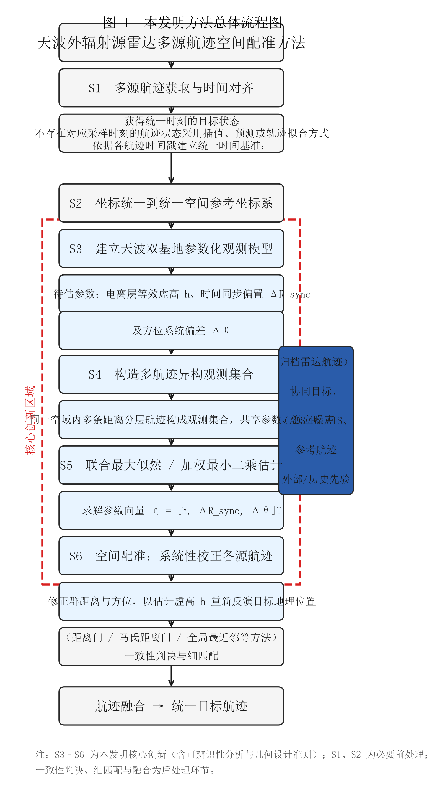
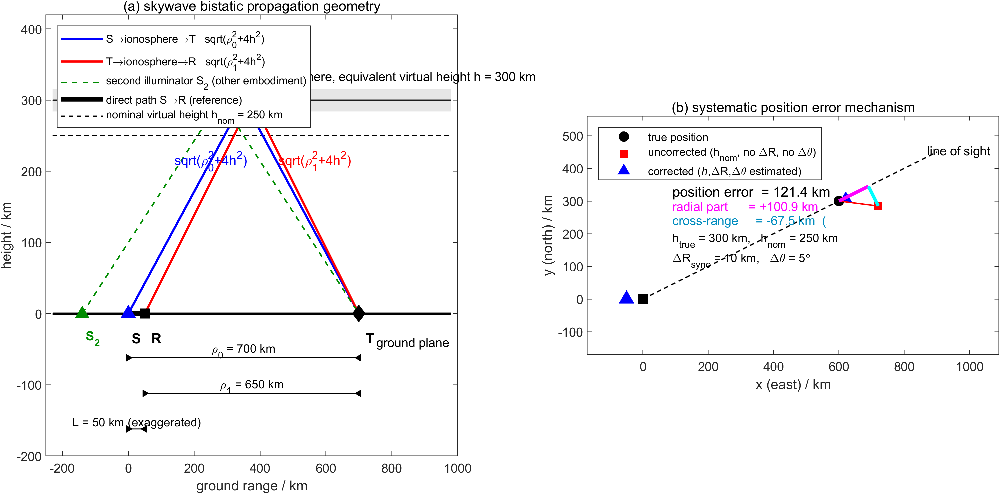
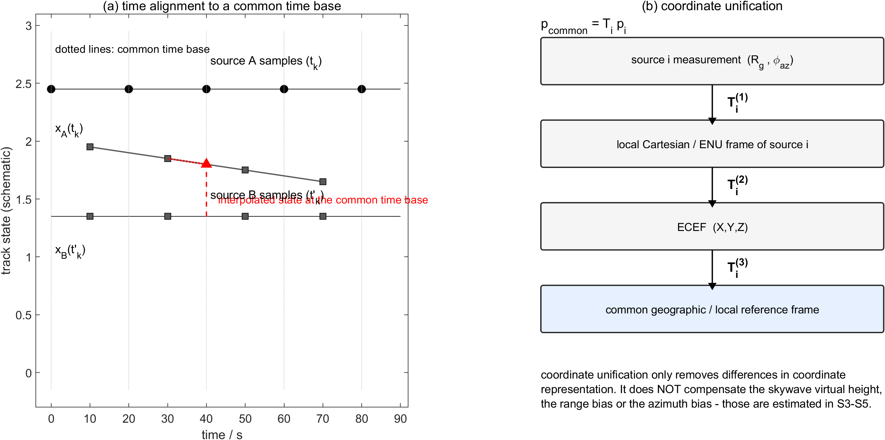
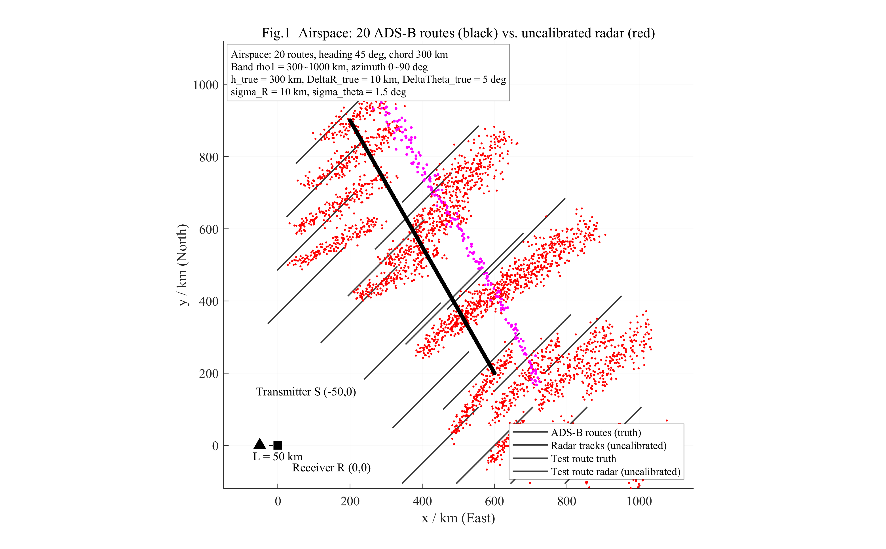
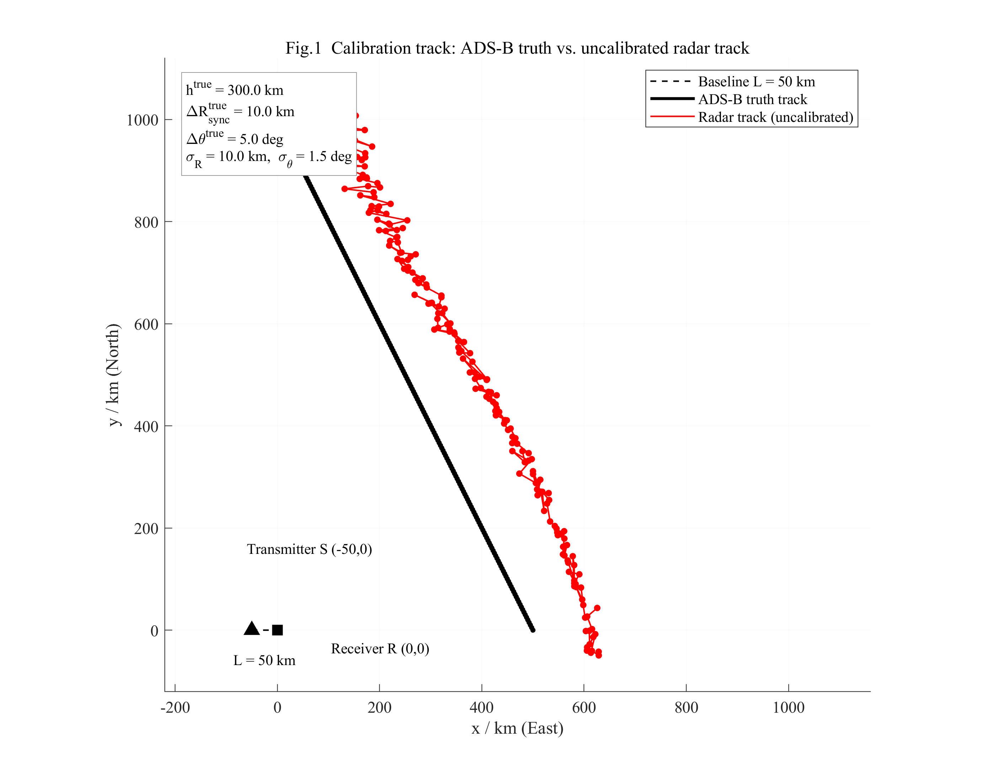
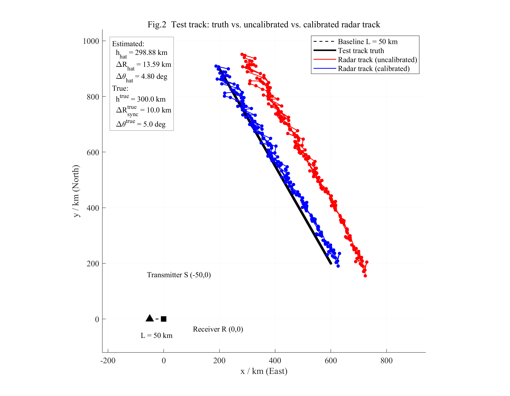
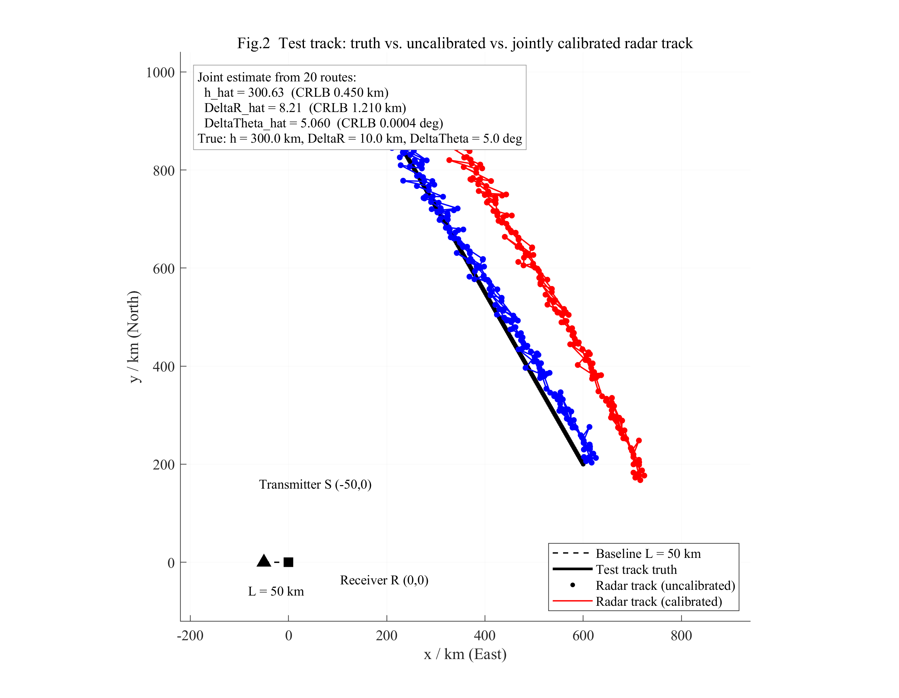
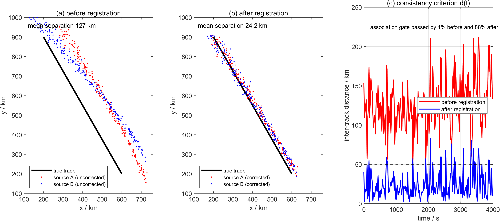

---

## 专利申请说明书

# 一、技术领域

本发明属于天波超视距雷达、外辐射源雷达、多站雷达航迹处理及目标定位技术领域，具体涉及一种基于多航迹联合参数估计的天波外辐射源雷达异步航迹空间配准方法，可用于多照射源天波外辐射源雷达系统中不同观测链路目标航迹的时空一致性矫正、航迹关联与多源融合的前置处理。

# 二、背景技术

## 2.1 天波外辐射源雷达的观测体制

天波超视距雷达利用高频（3–30 MHz）电磁波经电离层折射/等效反射实现超视距探测，可覆盖数千公里范围。外辐射源雷达（无源雷达）自身不发射信号，而是利用环境中已有的广播、通信等非合作照射源，接收站同时接收两类信号：

直达波：照射源经自由空间直接到达接收站的信号，路径为 $S\to R$；
目标回波：照射源经目标散射后到达接收站的信号，路径为 $S\to T\to R$（天波体制下为 $S\to$ 电离层 $\to T\to$ 电离层 $\to R$）。

由于外辐射源与接收站之间不存在统一时钟，接收站无法确知外辐射源的实际发射时刻，只能以直达波作为相对时间基准，通过目标回波与直达波之间的时延差构造距离信息。该相对时间基准仍会因脉冲压缩峰值定位误差、采样时钟漂移、直达波与回波路径的电离层传播差异等因素残留一个系统性的时间同步偏差 $\Delta t_{sync}$，在群距离观测量上等效为一个距离偏置 $\Delta R_{sync}$。

## 2.2 多源航迹处理面临的问题

当存在多个外辐射源（或多个观测链路）时，同一接收站将获得多条目标航迹。理论上同一真实目标的多条航迹应当一致，但实际中存在以下四类问题：

问题 1：多源观测异步。 不同观测链路的数据率、帧周期、航迹更新时刻可能不同。设链路 A 的采样时刻为 $t_1,t_2,\cdots$，链路 B 的采样时刻为 $t'_1,t'_2,\cdots$，若直接比较 $\mathbf x_A(t)$ 与 $\mathbf x_B(t')$，实际比较的是不同时刻的目标状态，对运动目标而言必然引入时间对应误差。

问题 2：坐标表达体系不同。 不同观测链路可能采用雷达局部极坐标、局部 ENU 坐标、地理坐标或 ECEF 坐标等不同参考系，直接比较将引入坐标表达差异。

问题 3：天波传播环境不确定。 电离层的电子密度、等效反射高度随时间和空间变化，工程上只能以等效虚高 $h$ 描述其传播效应。雷达测得的群距离为

$$R_g=\sqrt{\rho_0^2+4h^2}+\sqrt{\rho_1^2+4h^2}$$ {#eq:eq015}

若计算目标地理位置时采用的虚高与实际不符，则“群距离 $\to$ 目标地理位置”的转换本身产生系统偏差；该偏差不是简单的整体平移，而与目标距离、方位、照射源位置及电离层状态相关。

问题 4：观测链路存在系统偏差。 雷达阵列安装、坐标系基准、通道标定等因素造成固定的方位系统偏差 $\Delta\theta$；外辐射源与接收站的时间基准不一致造成距离系统偏差 $\Delta R_{sync}$。

上述四类问题的综合后果是：同一目标在不同观测链路中得到的地理位置不一致，不同照射源的航迹在地理坐标系中明显错开，甚至相距上百公里，因而无法直接进行航迹关联与融合。 需要说明的是，单纯的坐标转换（例如统一到 ECEF）只能消除问题 2，不能消除“测量本身已经偏离真实位置”的问题 3 与问题 4。

## 2.3 现有技术方案

（1）基于实时外部参考源的雷达网误差自配准。 以中国专利公开号 CN104267375A《一种外辐射源雷达网误差自配准方法》（申请号 201410531635.4，申请日 2014.10.08，公开日 2015.01.07，申请人 武汉大学，发明人 万显荣、易建新、程丰、吕敏，IPC 分类号 G01S 5/02）为代表的方案，针对多发单收/单发多收/多发多收外辐射源雷达网，利用接收站量测信息进行自配准。其技术要点为：

步骤 1：判断是否存在 ADS-B 或 AIS 提供的参照量测；若存在，则比较实际量测与参照量测的失配量，得到配准参数；
步骤 2：若不存在，则利用多个目标的量测构建双基地距离量测模型，将配准问题归结为非线性参数估计问题，经准线性化后求解；
步骤 3：采用两步最小二乘估计得到各发射站的双基地距离失配量 $\delta_m$ 与目标位置；
步骤 4：判断失配量是否收敛，未收敛则迭代；进而利用目标位置进行双基速度与到达角配准。

其双基地距离量测模型为 $u_{m,p}=\|\mathbf r_p-\mathbf q_m\|+\|\mathbf r_p\|+\delta_m+e_{m,p}$，即在地面欧氏距离意义下，各发射站对应一个距离失配量；配准参数（距离失配量、双基速度、到达角）作为线性或准线性参数，通过两步最小二乘求解，不需要发射站与接收站之间的合作式同步。

（2）多传感器航迹配准类方案。 常规多传感器航迹配准通常假定各传感器测量的是目标真实空间位置，仅存在坐标基准差异与传感器系统偏差，通过统一坐标系后估计传感器间的距离—方位偏差或二维平移量（如广义最小二乘配准、基于卡尔曼滤波的偏差估计、期望最大化配准等）实现航迹对齐。该类方案不涉及测量本身的传播路径建模。

（3）电离层参数获取类方案。 传统天波雷达通过电离层垂测/斜测、电离层模型预报或专用电离层探测设备获得等效虚高，再用于目标定位；也有方案利用已知位置的合作目标反演电离层参数。前者精度受电离层时空变化限制，后者依赖实时合作目标。

（4）基于伪线性化估计的外辐射源雷达误差校正。 以中国专利公开号 CN108387876A《基于CTLS的外辐射源雷达网双基距误差配准方法》（申请号 201810393298.5，申请日 2018.04.27，公开日 2018.08.10，申请人 杭州电子科技大学，发明人 左燕、陈志猛、蔡立平、张日东，IPC 分类号 G01S 7/40）为代表的方案，针对多发单收外辐射源雷达网，将双基距非线性方程引入中间变量 $R_{m,p}=\sqrt{\|\mathbf r_p-\mathbf q_m\|^2+\|\mathbf r_p\|^2}$ 转化为伪线性方程，先采用递推最小二乘得到初始估计，再考虑量测噪声对系数矩阵的影响，构造约束总体最小二乘（CTLS）估计模型，利用牛顿迭代法求解，最后通过关联最小二乘算法对估计结果进一步改进。该方案通过 CTLS 考虑了噪声结构化的问题，但未针对天波体制，且未涉及电离层等效虚高参数。

（5）基于误差校正的多站多外辐射源运动目标定位。 以中国专利授权公告号 CN110940976B《基于误差校正的多站多外辐射源雷达运动目标定位方法》（申请号 201911129934.4，申请日 2019.11.18，公开日 2020.03.31，授权日 2022.03.08，专利权人 杭州电子科技大学，发明人 左燕、蒋陶然、刘雪娇、郭宝峰、刘俊，IPC 分类号 G01S 13/88、G01S 7/40）为代表的方案，针对 M 发射源 × N 接收站 × P 目标的多站多外辐射源系统，将双基距和双基距变化率量测方程同时伪线性化，联立建立目标位置、速度及系统偏差的联合估计模型，通过迭代加权最小二乘估计，并引入辅助变量的关联性构建两阶关联最小二乘模型进一步修正误差，最后对双基距与双基距变化率量测进行后验迭代校正。该方案联合估计了目标运动状态（位置 + 速度）与系统偏差，并支持多站多源架构，但同样仅针对地面微波外辐射源雷达体制，未涉及天波传播环境参数的估计。

（6）基于点云配准的分布式雷达航迹误差校正。 以中国专利公开号 CN113866734A《一种分布式雷达系统航迹误差校正方法及装置》（申请号 202111464678.1，申请日 2021.12.03，公开日 2021.12.31，申请人 中国电子科技集团公司信息科学研究院，发明人 宋扬、葛建军、吕文超、刘光宏、裴晓帅、王欢、武艳伟，IPC 分类号 G01S 7/40）为代表的方案，以 ADS-B 航迹为参考，首先筛选航迹点数量不低于阈值 P 的航迹以确保连续性，再利用距离—角度—时间三重误差区间进行目标航迹与参考航迹的初步匹配，最后利用点云配准方法计算目标航迹相对于参考航迹的距离偏移量和角度偏移量，并通过迭代校正更新航迹位置。该方案侧重于工程实现层面的航迹预处理与点云配准流程，仅估计全局平移量（距离偏移 + 角度偏移），不建立传播参数化模型，不涉及电离层传播环境参数的估计与可辨识性分析。

（7）应用于短波主被动一体化雷达的电离层虚高估计。 以中国专利公开号 CN116243305A《一种应用于短波主被动一体化雷达的电离层虚高估计方法》（申请号 202310358441.8，申请日 2023.04.06，公开日 2023.06.09，申请人 哈尔滨工业大学、北京宇航系统工程研究所，发明人 耿钧、雷鹏、肖飒、东华鹏、弓川锦、王珂，IPC 分类号 G01S 13/88、G01S 13/87、G01S 7/41）为代表的方案，面向短波主被动一体化探测系统，利用主动雷达（地波通道）与被动雷达（天波通道）探测结果的相互匹配，以非线性整数规划方法，遍历搜索使代价函数最小的电离层虚高参数。该方案直接估计电离层等效虚高，但依赖主被动雷达的实时配对点迹，且仅输出单一虚高参数，未联合估计系统时间同步偏差，未涉及多航迹异构观测集合与参数可辨识性理论。

## 2.4 现有技术的不足

未将天波传播环境参数纳入配准模型。 CN104267375A 及常规多传感器配准方案（如 CN113866734A 的点云配准方案）中的观测模型为地面欧氏距离之和，待估参数为量测域的距离失配量等线性参数；而天波体制下群距离对虚高的依赖是非线性的（$R_g=\sqrt{\rho_0^2+4h^2}+\sqrt{\rho_1^2+4h^2}$），虚高误差会导致随距离变化的定位误差，无法用“一个距离失配量”等价描述，也无法用坐标转换消除。CN116243305A 虽直接估计电离层虚高，但依赖主被动雷达的实时配对点迹，且仅输出单一虚高参数，未联合估计系统偏差。

未解决传播参数与系统误差参数的可辨识性问题。 在天波群距离方程中，虚高 $h$ 与时间同步等效距离偏置 $\Delta R_{sync}$ 对各观测样本近似同向作用：$h$ 增大与 $\Delta R_{sync}$ 减小所产生的群距离增量几乎相同。现有技术既未指出该耦合的存在，也未给出估计精度的理论界限与解耦所需的观测几何条件。CN108387876A 的 CTLS 方法处理的是地面欧氏距离模型，其可辨识性与天波模型完全不同；CN110940976B 的多站多源架构虽引入多普勒量测，但仍针对微波体制。

对参考信息的依赖方式受限。 以实时 ADS-B/AIS 参照量测进行在线配准的方案（CN104267375A、CN113866734A），要求校准时刻存在可用的合作参考目标且能正确判定其对应航迹；CN116243305A 要求主被动雷达实时配对点迹。在实际应用条件下（例如民航停飞、实时广播数据不可用、参考目标空间分布不佳），该前提可能不成立。

仅利用单条参考航迹时估计精度受几何条件限制。 单条航迹的观测几何变化有限，$s_k$ 被限制在窄带内，即使增加该航迹的采样点数，也只能获得 $1/\sqrt N$ 的算术改善，不能消除 $h$ 与 $\Delta R_{sync}$ 的强耦合，导致 $\Delta R_{sync}$ 估计误差显著放大。CN110940976B 虽利用双基距变化率提供额外方程，但未给出几何条件对估计精度影响的定量分析。

缺少传播环境参数与系统误差参数的联合估计与解耦机制。 CN110940976B 联合估计了目标运动状态与系统偏差，但未将电离层虚高作为未知参数；CN108387876A 的 CTLS 方法考虑了噪声结构化，但其模型未包含传播环境参数；CN113866734A 仅估计全局偏移量，不涉及参数化传播模型；CN116243305A 单独估计虚高，未与系统偏差联合反演。本发明首次将电离层等效虚高作为未知参数与系统误差参数联合反演，并通过多航迹异构观测集合实现二者的几何解耦。

缺少“配准—关联—融合”链条的完整衔接。 现有方案多聚焦于配准参数求解本身，未明确配准结果如何用于多源航迹的一致性判决与后续融合，也未给出配准精度与关联门限之间的定量关系。CN113866734A 虽提到了航迹关联与融合的后处理需求，但未给出配准精度与关联门限的定量关系。

## 2.5 本发明与最接近现有技术的区别

### 2.5.1 与最接近现有技术 CN104267375A 的区别

| 对比维度 | CN104267375A（最接近现有技术） | 本发明 |
| --- | --- | --- |
| 传播体制 | 地面视距微波外辐射源雷达网，双基地距离为地面欧氏距离之和 | 天波外辐射源雷达，群距离为经电离层等效虚高的斜距之和 |
| 观测模型 | $u=\|\mathbf r_p-\mathbf q_m\|+\|\mathbf r_p\|+\delta_m+e$ | $R_g=\sqrt{\rho_0^2+4h^2}+\sqrt{\rho_1^2+4h^2}+\Delta R_{sync}+\varepsilon_R$，另含方位方程 $\phi=\operatorname{atan2}(x,y)+\Delta\theta+\varepsilon_\theta$ |
| 待估参数性质 | 各发射站距离失配量 $\delta_m$（线性）、双基速度、到达角 | 电离层等效虚高 $h$（非线性，与目标距离强耦合）、时间同步等效距离偏置 $\Delta R_{sync}$、方位系统偏差 $\Delta\theta$ |
| 参数化对象 | 量测域的失配量 | 地理定位模型中的传播环境参数与系统误差参数，目标位置为参数的函数 $\mathbf x=f(\mathbf z;\boldsymbol\eta)$ |
| 参考信息使用方式 | 实时 ADS-B/AIS 参照量测（在线配准），无参照时用多目标量测 | 外部或历史先验参考航迹（离线参数反演），明确不依赖实时合作目标与实时参照量测 |
| 数据利用方式 | 单站多目标或多站观测 | 同一空域内多条距离分层航迹构成的异构观测集合，样本共享同一组参数、噪声各自独立 |
| 可辨识性 | 未涉及，直接将失配量作为线性参数求解 | 显式给出 Fisher 信息矩阵结构、CRLB 封闭表达式、耦合相关系数及观测几何设计准则 |
| 异步与坐标 | 未涉及 | 明确区分”航迹时间对齐误差”与”系统时间同步误差 $\Delta t_{sync}\Rightarrow\Delta R_{sync}$”，并给出坐标统一与参数化配准的边界 |
| 完整链路 | 得到配准参数与目标位置估计 | 配准后统一空间基准，并衔接一致性判决、细匹配与融合 |

: 与最接近现有技术 CN104267375A 的区别对比 {#tbl:compare_cn104267375}

### 2.5.2 与其他现有技术的关键区别

| 对比维度 | CN108387876A | CN110940976B | CN113866734A | CN116243305A | 本发明 |
| --- | --- | --- | --- | --- | --- |
| 传播体制 | 地面微波 | 地面微波 | 地面微波（未明确） | 短波天波 | 天波外辐射源 |
| 传播模型 | 欧氏距离之和 | 欧氏距离之和 + 变化率 | 极坐标距离/角度 | 斜距群距离 $R_g$ | 斜距群距离 $R_g$（含 $h$） |
| 是否估计虚高 $h$ | 否 | 否 | 否 | 是（唯一） | 是（联合估计） |
| 是否估计系统偏差 | $\delta_m$（多点） | $\delta_{m,n}$（多站多点） | 全局距离/角度偏移 | 否 | $\Delta R_{sync}$、$\Delta\theta$（联合） |
| 是否联合估计传播参数与系统偏差 | 否 | 否 | 否 | 否 | 是 |
| 参考信息 | ADS-B/AIS 实时参照 | 无参考（自配准） | ADS-B 实时参照 | 主被动雷达配对点迹 | 外部/历史先验参考航迹 |
| 是否依赖实时合作目标 | 是 | 否 | 是 | 是（实时配对） | 否 |
| 多航迹联合估计 | 否（多目标并行） | 是（多站多源） | 否（全局平均偏移） | 否 | 是（多航迹异构集合） |
| 可辨识性理论 | 无 | 无 | 无 | 无 | CRLB + Fisher + 几何准则 |
| 观测几何设计 | 无 | 无 | 无 | 无 | 有（距离分层准则） |
| 配准后链路 | 无 | 无 | 无 | 无 | 关联门限定量关系 |

: 与其他现有技术的关键区别对比 {#tbl:compare_others}

综上，现有五项相关专利（CN104267375A、CN108387876A、CN110940976B、CN113866734A、CN116243305A）及常规多传感器配准方案均未公开"将电离层等效虚高作为未知参数纳入多源航迹空间配准模型，并以观测几何异构的多航迹联合观测集合对其进行联合估计、同时给出可辨识性条件与观测几何设计准则"的技术方案。特别是：

CN104267375A 针对地面微波外辐射源雷达网，未涉及天波传播模型；
CN108387876A 虽引入 CTLS 处理噪声结构化问题，但其观测模型仍为地面欧氏距离之和，且未涉及电离层虚高；
CN110940976B 虽扩展至多站多源并联合估计目标速度，但同样针对地面微波体制，未涉及传播环境参数；
CN113866734A 采用点云配准方法估计全局偏移量，未建立传播参数化模型；
CN116243305A 虽直接估计电离层虚高，但依赖主被动雷达实时配对点迹，未联合估计系统偏差，未涉及多航迹异构观测集合与可辨识性理论。

# 三、发明内容

## 3.1 要解决的技术问题

本发明要解决的技术问题是：

解决天波外辐射源雷达在多源异步、观测几何异构以及传播参数与系统误差参数耦合条件下的航迹空间不一致问题。

该问题可分解为三个相互关联的子问题：

传播环境参数进入定位模型的问题——如何把电离层等效虚高 $h$ 显式参数化，使目标地理位置成为未知参数的函数 $\mathbf x=f(\mathbf z;h,\Delta R_{sync},\Delta\theta)$，从而为参数反演提供数学抓手；
传播参数与系统误差参数的可分离问题——在 $h$ 与 $\Delta R_{sync}$ 近似同向作用的前提下，如何利用多航迹观测几何的差异构造可辨识的观测集合，并给出精度界限；
配准结果与航迹处理链条的衔接问题——如何用估计参数完成统一空间基准下的系统性校正，并据以进行一致性判决、细匹配与融合。

本发明的写作与实施力度分配如下（也是本专利创造性投入的分配）：

| 层次 | 内容 | 定位 | 在本发明中的力度 |
| --- | --- | --- | --- |
| 第一层 | 时间对齐、坐标统一 | 必要前处理 | 约 10%（写完整，不展开） |
| 第二层 | 天波参数化模型、多航迹异构观测集合、联合估计、可辨识性、空间配准 | 核心创新 | 约 70% |
| 第三层 | 一致性判决、细匹配 | 必要后处理 | 约 10% |
| 第四层 | 航迹融合与完整流程验证 | 应用环节 | 约 10% |

: 内容层次与力度分配 {#tbl:layer_allocation}

## 3.2 技术方案

本发明方法总体流程如图 1 所示，由步骤 S1 至 S6 组成。其中 S3～S6 为本发明的核心，S1、S2 为必要前处理，一致性判决、细匹配与融合为后处理。

{#fig:flowchart}

### S1 多源异步航迹获取及时间对齐

获取多个外辐射源观测链路各自形成的目标航迹，以及至少一条外部或历史先验参考航迹。对不同观测源获取的航迹数据，根据各航迹对应的时间戳建立统一时间基准；对于不同观测源在统一时间基准下不存在对应采样时刻的情况，根据相邻时刻航迹状态采用插值、预测或轨迹拟合等方式获得统一时刻下的目标状态，从而减小由于不同观测源数据更新时刻不一致所引入的时间对应误差。

在一种实施方式中，采用线性插值：

$$\hat{\mathbf x}(t)=\mathbf x_k+\frac{t-t_k}{t_{k+1}-t_k}\left(\mathbf x_{k+1}-\mathbf x_k\right)$$ {#eq:eq016}

其中 $t_k,t_{k+1}$ 为相邻航迹采样时刻，$\mathbf x_k,\mathbf x_{k+1}$ 为对应目标状态，$t$ 为统一时间基准下的目标时刻。也可采用多项式插值、状态预测（如匀速/匀加速外推）或轨迹拟合。

时间量级分析（说明本步骤不可忽略但其量级低于主要空间系统误差）： 取目标速度 $v=300$ m/s（约 0.6 马赫），则

| 两源采样时刻差 $\Delta t$ | 目标位移（位置对应误差） |
| ---: | ---: |
| 1 s | 0.3 km |
| 5 s | 1.5 km |
| 10 s | 3 km |
| 20 s | 6 km |

: 采样时刻差与目标位移对应关系 {#tbl:time_offset}

在本发明所针对的天波外辐射源雷达系统中，距离采样/分辨尺度本身即为公里量级，主要空间系统误差（电离层虚高误差、距离与方位系统偏差）造成的目标位置偏差可达上百公里（见 §5.14、§5.15 实施例）。因此时间对齐必须完成以保证时间对应关系正确，但其误差量级低于本发明重点解决的空间系统误差。

需要特别区分两类“时间”问题：

| 类别 | 物理含义 | 处理方式 | 是否进入核心估计模型 |
| --- | --- | --- | --- |
| ① 航迹时间对齐误差 | 链路 A 在 10:00:00 更新、链路 B 在 10:00:02 更新，导致比较的不是同一时刻的目标状态 | 前处理：插值/预测/轨迹拟合（本步骤 S1） | 否 |
| ② 系统同步误差 $\Delta t_{sync}$ | 照射源、接收机或观测链路之间存在系统性时间基准偏差 | 表现为群距离观测中的系统偏差 $\Delta R_{sync}$ | 是（作为待估参数进入 S3～S5） |

: 两类时间问题区分 {#tbl:time_problems}

即：航迹时间对齐解决“采样时刻不一致”，系统同步误差解决“时间基准不一致”，二者不可混淆；本发明将后者以 $\Delta R_{sync}$ 的形式纳入参数化观测模型统一估计。

### S2 坐标统一

将不同观测源获得的目标位置、速度及相关观测信息由各自参考坐标系转换至统一地理参考坐标系或统一局部笛卡尔坐标系，为后续异构航迹参数估计、空间配准及航迹一致性判决提供统一的空间表达基础：

$$\mathbf p_{common}=\mathbf T_i\,\mathbf p_i$$ {#eq:eq017}

其中 $\mathbf p_i$ 为第 $i$ 个观测源的坐标表达，$\mathbf T_i$ 为其到公共坐标系的转换关系（可依次包含局部极坐标→局部 ENU、ENU→ECEF、ECEF→公共地理/局部坐标等环节）。

坐标统一仅用于消除不同观测源之间坐标表达形式的差异，不用于补偿天波传播虚高、距离系统偏差及方位系统偏差；上述误差由后续参数化空间配准过程进行估计和修正。

上述限定使本发明的“坐标统一”与“空间配准”在技术上严格区分：前者是坐标表达的等价变换，后者是测量系统误差的参数化估计与补偿。这一点也是本发明区别于常规多传感器坐标转换类方案的关键之一。

### S3 建立天波双基地参数化观测模型

坐标与几何量。 采用局部平面直角坐标系：接收站 $R$ 位于原点 $(0,0)$，照射源 $S$ 位于 $(x_s,y_s)$（实施中取 $(-50,0)$ km，基线 $L=50$ km），$x$ 轴指向东、$y$ 轴指向北，方位角定义为北偏东为正，即 $\phi_{az}=\operatorname{atan2}(x,y)$。对目标位置 $(x,y)$：

$$\rho_1=\sqrt{x^2+y^2},\qquad \rho_0=\sqrt{(x-x_s)^2+(y-y_s)^2}$$ {#eq:eq018}

含参数的群距离观测方程。 考虑电离层等效虚高 $h$（上下行等效反射高度相同）与时间同步等效距离偏置 $\Delta R_{sync}$：

$$R_{g,k}^{obs}=\sqrt{\rho_{0,k}^2+4h^2}+\sqrt{\rho_{1,k}^2+4h^2}+\Delta R_{sync}+\varepsilon_{R,k}$$ {#eq:eq019}

方位观测方程。 考虑方位系统偏差 $\Delta\theta$（阵列安装、坐标系基准、通道标定等造成）：

$$\phi_{az,k}^{obs}=\operatorname{atan2}(x_k,y_k)+\Delta\theta+\varepsilon_{\theta,k}$$ {#eq:eq020}

参数向量。 待估参数为

$$\boldsymbol\eta=\begin{bmatrix}h\\ \Delta R_{sync}\\ \Delta\theta\end{bmatrix}$$ {#eq:eq021}

其中 $h$ 以 km 计、$\Delta R_{sync}$ 以 km 计、$\Delta\theta$ 以度计。三类参数的物理含义与量级为：

| 参数 | 物理含义 | 量级 | 在模型中的作用方式 |
| --- | --- | --- | --- |
| $h$ | 电离层等效虚高，上下行等效反射高度 | 250–400 km | 非线性进入群距离，作用强度随目标距离变化 |
| $\Delta R_{sync}$ | 时间同步等效距离偏置，$\Delta R_{sync}=c\,\Delta t_{sync}$（系数依双基地距离定义确定） | km 量级 | 对群距离整体平移（线性） |
| $\Delta\theta$ | 方位系统偏差 | 度量级（典型数度） | 对方位整体旋转（线性） |

: 参数物理含义与量级 {#tbl:param_meaning}

### S4 构造多航迹异构观测集合

步骤内容： 在同一接收站覆盖空域内选取多条空间几何条件不同的航迹作为校准航迹，与先验参考航迹逐点配准后构成观测集合

$$\mathcal Z=\left\{\left(R_{g,k}^{obs,(m)},\ \phi_{az,k}^{obs,(m)},\ \rho_{0,k}^{(m)},\ \rho_{1,k}^{(m)},\ \phi_{az,k}^{ref,(m)}\right)\right\}_{m=1\cdots M,\ k=1\cdots N_m}$$ {#eq:eq022}

其中 $M$ 为校准航迹条数，$N_m$ 为第 $m$ 条航迹的有效样本数，$N_{tot}=\sum_m N_m$ 为总样本数。所述多条航迹共享同一组待估参数 $\boldsymbol\eta$，但各自具有独立的随机噪声实现。

为什么需要“异构”（本发明的理论依据）。 记群距离对虚高的灵敏度

$$s_k=\frac{\partial R_{g,k}}{\partial h}=\frac{4h}{\sqrt{\rho_{0,k}^2+4h^2}}+\frac{4h}{\sqrt{\rho_{1,k}^2+4h^2}}$$ {#eq:eq023}

则群距离对 $h$ 与 $\Delta R_{sync}$ 的一阶增量近似为

$$\delta R_{g,k}\approx s_k\,\delta h+\delta(\Delta R_{sync})$$ {#eq:eq024}

若观测集合中所有样本的几何条件相近，则 $s_1\approx s_2\approx\cdots\approx s_{N_{tot}}$，$h$ 与 $\Delta R_{sync}$ 对群距离的作用几乎重合，二者高度耦合；只有在 $s_k$ 具有足够离散度时，二者才可分离。定义

$$\bar s=\frac1{N_{tot}}\sum_k s_k,\qquad \overline{s^2}=\frac1{N_{tot}}\sum_k s_k^2,\qquad \operatorname{Var}(s)=\overline{s^2}-\bar s^{\,2}$$ {#eq:eq025}

则 Fisher 信息矩阵中决定 $h$ 与 $\Delta R_{sync}$ 可分离性的核心项即为 $\operatorname{Var}(s)$：其值越大，二者越可辨识。 由于 $s_k$ 仅依赖目标至照射源与至接收站的地面距离（不依赖航向），因此“异构”的具体含义是至接收站地面距离分布跨度大（即距离分层丰富），而不要求航向多样（见 §5.16 实验）。

因此本发明的核心逻辑是： 不是简单地“多使用几条航迹”，而是利用具有不同空间几何条件（距离分层）的异构航迹，提高传播参数与系统误差参数之间的可辨识性；同时，总样本数 $N_{tot}$ 的增加带来 $1/\sqrt{N_{tot}}$ 的算术改善。二者缺一不可。

### S5 联合最大似然 / 加权最小二乘估计

对第 $m$ 条航迹的第 $k$ 个样本，定义距离残差与方位残差：

$$r_{R,k}^{(m)}=R_{g,k}^{obs,(m)}-\sqrt{\rho_{0,k}^{(m)2}+4h^2}-\sqrt{\rho_{1,k}^{(m)2}+4h^2}-\Delta R_{sync}$$ {#eq:eq026}

$$r_{\theta,k}^{(m)}=\phi_{az,k}^{obs,(m)}-\phi_{az,k}^{ref,(m)}-\Delta\theta$$ {#eq:eq027}

构造加权残差代价函数：

$$J(\boldsymbol\eta)=\sum_{m=1}^{M}\sum_{k=1}^{N_m}\left[\frac{(r_{R,k}^{(m)})^2}{\sigma_R^2}+\frac{(r_{\theta,k}^{(m)})^2}{\sigma_\theta^2}\right]$$ {#eq:eq028}

求：

$$\hat{\boldsymbol\eta}=\arg\min_{\boldsymbol\eta}J(\boldsymbol\eta)$$ {#eq:eq029}

在距离与方位噪声相互独立且为零均值高斯、且噪声方差已知的条件下，该加权最小二乘目标函数与观测似然函数等价，即

$$\hat{\boldsymbol\eta}=\arg\max_{\boldsymbol\eta}p(\mathcal Z\mid\boldsymbol\eta)$$ {#eq:eq030}

亦即为最大似然估计。

需要说明的是：最大似然估计或最小二乘本身是成熟数学工具，不构成本发明的创新点。 本发明的创新在于：估计什么参数（$h,\Delta R_{sync},\Delta\theta$）、这些参数如何进入天波传播定位模型、为什么在给定观测集合下可以被估计（可辨识性）、以及利用什么样的数据集合去估计（多航迹异构观测集合）。

在一种实施方式中，以残差向量

$$\mathbf r(\boldsymbol\eta)=\left[\cdots,\ \frac{r_{R,k}^{(m)}}{\sigma_R},\ \frac{r_{\theta,k}^{(m)}}{\sigma_\theta},\ \cdots\right]^{T}$$ {#eq:eq031}

为输入，采用列文伯格-马夸尔特算法求解，并对参数设置物理可行区间作为边界约束（实施取值见 §5.9 表）。

### S6 空间配准、一致性判决与融合

空间配准的定义（本发明所称配准的含义）。 所述空间配准，是指基于估计得到的传播环境参数及系统误差参数，对不同观测源航迹在统一参考坐标系下的空间位置及相关状态进行系统性校正，使不同观测源对同一目标的航迹在统一空间基准下具有一致的空间表达。

具体校正方式为：先修正观测量的系统偏差，再按参数化定位模型反演目标地理位置：

$$R_{g,k}^{corr}=R_{g,k}^{obs}-\widehat{\Delta R}_{sync},\qquad
\phi_{az,k}^{corr}=\phi_{az,k}^{obs}-\widehat{\Delta\theta}$$ {#eq:eq032}

$$r_k=\sqrt{\left(\frac{R_{g,k}^{corr}}{2}\right)^2-4\hat h^2},\qquad
x_k=r_k\sin\phi_{az,k}^{corr},\qquad
y_k=r_k\cos\phi_{az,k}^{corr}$$ {#eq:eq033}

（当 $R_{g,k}^{corr}/2<2\hat h$ 时该点不可用；实施中因基线 $L=50$ km 远小于目标距离，采用上述单基地近似反演，工程上也可采用双基地精确反演。）

一致性判决与细匹配（后处理环节）。 配准完成并获得统一空间基准后，进一步进行候选航迹筛选与细匹配：
候选航迹筛选：根据空间距离、速度差、航向差、时间对应关系筛选可能对应同一目标的航迹；
细匹配：对候选航迹计算 $d_p=\|\mathbf p_A-\mathbf p_B\|$、$d_v=\|\mathbf v_A-\mathbf v_B\|$、$d_\psi=|\psi_A-\psi_B|$，必要时考虑多时刻轨迹残差，综合形成一致性判据 $D=w_pd_p+w_vd_v+w_\psi d_\psi$，当 $D<T$ 时判定两条航迹对应同一目标。

所述一致性判决及细匹配可采用现有航迹关联方法实现，包括距离门、椭圆门、马氏距离门、最近邻、全局最近邻、多假设关联等。该部分为使系统完整运行的必要步骤，并非本发明的核心创新点；其与本发明核心的衔接关系在于：配准精度直接决定一致性门限可取的大小（见 §5.17 实施例四：配准前航迹间距均值 $126.58$ km，配准后均值降至 $24.16$ km，$50$ km 关联门通过率由 $1\%$ 提升至 $88\%$）。

航迹融合（后处理环节）。 对经一致性判决及细匹配确定属于同一目标的多源航迹进行融合，获得统一目标航迹。所述融合方法可采用卡尔曼滤波、扩展卡尔曼滤波、无迹卡尔曼滤波、交互多模型滤波、加权状态融合、协方差交叉融合等现有方法。本发明重点解决多源航迹在融合前无法可靠对齐的问题；完成配准与关联后，可采用现有航迹融合方法生成统一航迹。

## 3.3 有益效果

效果 1：降低天波传播参数不确定性带来的定位误差。 通过将电离层等效虚高作为未知参数与系统误差参数联合反演，避免使用不准确的先验虚高进行定位。实施例一中虚高估计相对误差 $0.374\%$；由于未校准时采用标称虚高 $h_{nom}=250$ km 反演，单点位置误差达 $121.4$ km（其中径向分量 $+100.9$ km），校准后同一位置误差降至 $22.4$ km。

效果 2：降低距离/方位系统偏差对航迹空间一致性的影响。 实施例一中待测航迹位置误差均方根由 $117.165$ km 降至 $24.722$ km，下降 $78.9\%$；实施例二中切向待测航迹由 $116.191$ km 降至 $25.128$ km，径向待测航迹由 $124.272$ km 降至 $27.229$ km；残差量级回落至随机噪声水平（距离残差 RMSE 由 $9.522$ km 变为 $9.501$ km，量级与 $\sigma_R=10$ km 一致）。

效果 3：利用多航迹异构观测提高参数可辨识性。 实施例三中，时间同步距离偏置的估计标准差由典型单条航迹的 $12.075$ km 降至 $20$ 条距离分层航迹联合估计的 $1.208$ km，改善 $10.0$ 倍（相对最有利单条航迹 $10.108$ km 为 $8.4$ 倍）；蒙特卡洛 $300$ 次实测标准差 $1.177$ km、偏差 $+0.011$ km，与 CRLB 一致，表明达到该几何下的有效估计量精度。同时给出了观测几何设计准则：等样本量下，全部航线集中于同一距离层会使 $\sigma_{\Delta R}$ 由 $2.370$ km 恶化至 $5.053$ km（约 $2.13$ 倍）。

效果 4：提高配准后多源航迹的一致性，为关联与融合提供基础。 实施例四中，两个具有不同系统误差参数的照射源链路，其未校准航迹间距均值 $126.58$ km（$48.64\sim211.65$ km），经各自参数估计与配准后降至均值 $24.16$ km（$2.02\sim83.32$ km）；以 $50$ km 为关联门限，通过率由 $1\%$ 提高到 $88\%$，即原本无法可靠关联的多源航迹在配准后可以可靠关联，从而为后续融合提供输入。

效果 5（工程适用性）：不依赖实时合作目标。 本发明可使用历史归档或外部先验参考航迹完成离线参数估计。以 ADS-B 数据为例，其角色是外部参考信息源（提供目标真实位置的参考信息以构建观测残差），而非本发明的核心；所述外部参考信息还可来源于 AIS、协同目标信息、其他雷达航迹或其他具有较高定位精度的目标参考信息。

# 四、附图说明

| 附图 | 文件 | 内容 |
| --- | --- | --- |
| 图 1 | `patent_fig1_flow.png` | 本发明方法总体流程图（S1～S6，核心范围 S3～S6） |
| 图 2 | `patent_fig1_scenario.png` | 观测场景与天波双基地传播几何：(a) 垂直剖面传播几何（照射源—电离层—目标—电离层—接收站、直达波参考、标称虚高）；(b) 平面位置误差机理（真实位置、未校准反演位置、校准后位置及径向/切向分解） |
| 图 3 | `patent_fig3_time_coord.png` | 前处理环节：(a) 多源异步航迹到统一时间基准的时间对齐与插值；(b) 坐标统一链（局部量测→局部 ENU→ECEF→公共参考系）及其边界说明 |
| 图 4 | `fig1_airspace_routes.png` | 空域多航线异构观测集合布局（$20$ 条近似平行航线，$4$ 个距离层 × $5$ 个方位）与未校准雷达航迹 |
| 图 5 | `fig1_calibration_track.png` | 校准（先验参考）航迹：先验参考航迹与未校准雷达航迹对比，展示三类系统误差叠加造成的系统性偏置 |
| 图 6 | `fig2_test_track.png` | 待测航迹：真实位置、未校准雷达航迹与校准后雷达航迹对比 |
| 图 7 | `fig2_multitrack_calib.png` | 多航迹联合估计的校准效果与参数估计结果 |
| 图 8 | `patent_fig6_two_source.png` | 双照射源配准前后航迹间距与一致性判决：(a) 配准前；(b) 配准后；(c) 航迹间距随时间变化与关联门限 |

: 附图目录 {#tbl:fig_list}

---

# 五、具体实施方式

以下结合附图说明本发明的具体实施方式。本实施方式以天波外辐射源雷达、单接收站、多照射源场景为例，给出完整的数学建模、参数设置、求解流程与仿真验证结果。

## 5.1 系统场景

如图 2(a) 所示，系统由照射源 $S$、接收站 $R$、目标 $T$ 及电离层传播路径构成。信号自照射源发出，经电离层折射/等效反射照射目标，目标散射后再经电离层传播到达接收站，构成 $S\to$ 电离层 $\to T\to$ 电离层 $\to R$ 的双基地传播路径；同时照射源信号经自由空间直接到达接收站形成直达波，作为相对时间基准。图中同时示出第二条照射源 $S_2$ 的传播路径（同一接收站同时接收多个照射源的直达波与目标回波，形成多源观测链路），以及用于反演定位的标称虚高 $h_{nom}$ 与真实虚高 $h$ 的差异。

{#fig:scenario}

如图 2(b) 所示，未校准时以标称虚高 $h_{nom}=250$ km 反演、且不修正 $\Delta R_{sync}$ 与 $\Delta\theta$，目标（真实位置 $(600,300)$ km）的反演位置为 $(720.5,284.7)$ km，位置误差 $121.4$ km，其中沿视线（径向）分量 $+100.9$ km、切向（横向）分量 $-67.5$ km（与 $r\Delta\theta$ 量级 $58.5$ km 相当）；使用估计参数校准后，反演位置误差降至 $22.4$ km，残余误差由随机测量噪声决定。

## 5.2 坐标系与几何量定义

采用局部平面直角坐标系（亦可通过 S2 统一到 ECEF/地理坐标系后使用）：

| 量 | 定义 | 实施取值 |
| --- | --- | --- |
| 接收站 $R$ | 坐标原点 | $(0,0)$ km |
| 照射源 $S$ | 已知位置 | $(-50,0)$ km |
| 基线 $L$ | $\|S-R\|$ | $50$ km |
| 目标 $T$ | $(x,y)$ | 由航迹给定 |
| 至接收站地面距离 | $\rho_1=\sqrt{x^2+y^2}$ | — |
| 至照射源地面距离 | $\rho_0=\sqrt{(x-x_s)^2+(y-y_s)^2}$ | — |
| 方位角 | $\phi_{az}=\operatorname{atan2}(x,y)$（北偏东为正） | $(-\pi,\pi]$ |

: 坐标系与几何量定义 {#tbl:coord_system}

## 5.3 时间对齐（S1）

如图 3(a) 所示，链路 A 的采样时刻为 $t_k=kT_s$（$k=0,20,40,60,80$ s），链路 B 的采样时刻为 $t'_k=10+20k$（s），二者在统一时间基准（图中点线）下不存在对应采样时刻。按 S1 所述方式，对链路 B 在 $t=40$ s 处的状态由 $t'=30$ s 与 $t'=50$ s 两点线性插值获得，从而实现两链路在统一时间基准下的状态对应。

{#fig:time_coord}

本步骤为本发明的前处理环节，可采用线性插值、多项式插值、状态预测或轨迹拟合等多种实现方式；其所消除的是“采样时刻不一致”造成的时间对应误差，不涉及系统时间同步误差 $\Delta t_{sync}$。

## 5.4 坐标统一（S2）

如图 3(b) 所示，各观测链路的量测由局部坐标依次经 $\mathbf T_i^{(1)}$、$\mathbf T_i^{(2)}$、$\mathbf T_i^{(3)}$ 转换至公共参考系：源 $i$ 的极坐标量测 $(R_g,\phi_{az})$ $\to$ 局部笛卡尔/ENU $\to$ ECEF $\to$ 公共地理/局部参考系，即 $\mathbf p_{common}=\mathbf T_i\mathbf p_i$。

本步骤只解决坐标表达差异，不补偿天波传播虚高、距离系统偏差与方位系统偏差——上述误差在 S3～S5 的参数化配准中估计与修正。本步骤不作专门仿真，以数学关系说明。

## 5.5 天波双基地参数化传播模型（S3，核心）

群距离正演方程（上下行等效虚高相同）：

$$R_g=\sqrt{\rho_0^2+4h^2}+\sqrt{\rho_1^2+4h^2}$$ {#eq:eq034}

含系统误差与随机噪声的观测方程：

$$R_{g,k}^{obs}=\sqrt{\rho_{0,k}^2+4h^2}+\sqrt{\rho_{1,k}^2+4h^2}+\Delta R_{sync}+\varepsilon_{R,k}$$ {#eq:eq035}

$$\phi_{az,k}^{obs}=\operatorname{atan2}(x_k,y_k)+\Delta\theta+\varepsilon_{\theta,k}$$ {#eq:eq036}

模型对参数的灵敏度（决定可辨识性）：

$$\frac{\partial R_g}{\partial h}=\frac{4h}{\sqrt{\rho_0^2+4h^2}}+\frac{4h}{\sqrt{\rho_1^2+4h^2}}\equiv s_k,\qquad
\frac{\partial R_g}{\partial(\Delta R_{sync})}=1,\qquad
\frac{\partial \phi_{az}}{\partial(\Delta\theta)}=1$$ {#eq:eq037}

即 $\Delta R_{sync}$ 对群距离是整体平移（线性、与几何无关），而 $h$ 对群距离的作用强度 $s_k$ 随目标距离变化。取 $h=300$ km 时，$s_k$ 与目标距离的关系近似为 $s_k\approx 4h/\rho$：

| $\rho$ / km | 300 | 400 | 500 | 600 | 700 | 800 | 900 | 1000 |
| --- | --- | --- | --- | --- | --- | --- | --- | --- |
| $s_k\approx4h/\rho$ | 4.00 | 3.00 | 2.40 | 2.00 | 1.71 | 1.50 | 1.33 | 1.20 |

: $s_k$ 与目标距离的关系近似值 {#tbl:sensitivity_distance}

模型适用范围（本实施方式的假设）： 局部平面坐标系；发射站与接收站位置已知且可分离；上下行等效虚高相同；目标高度忽略；不考虑地球曲率与大圆距离；时间同步误差等效为常数距离偏置 $\Delta R_{sync}$；方位系统偏差为常数 $\Delta\theta$；距离与方位随机误差相互独立且为零均值高斯。

## 5.6 观测误差模型（S3 续）

| 类别 | 符号 | 说明 | 实施取值 |
| --- | --- | --- | --- |
| 电离层等效虚高 | $h^{true}$ | 待估参数，非线性进入群距离 | $300$ km |
| 时间同步等效距离偏置 | $\Delta R_{sync}^{true}$ | 待估参数，$=c\Delta t_{sync}$（系数依距离定义确定） | $10$ km |
| 方位系统偏差 | $\Delta\theta^{true}$ | 待估参数 | $5^\circ$ |
| 距离随机噪声 | $\varepsilon_R\sim N(0,\sigma_R^2)$ | 与方位噪声独立 | $\sigma_R=10$ km |
| 方位随机噪声 | $\varepsilon_\theta\sim N(0,\sigma_\theta^2)$ | 与距离噪声独立 | $\sigma_\theta=1.5^\circ$ |
| 未校准反演标称虚高 | $h_{nom}$ | 仅用于未校准反演对比 | $250$ km |

: 观测误差模型参数 {#tbl:error_model}

系统误差真值仅用于生成仿真数据与评价，估计器不使用真值。

## 5.7 外部参考航迹信息（S4 输入）

本发明中外部参考信息的角色是为目标真实位置提供参考量，用于构造观测残差并辅助估计传播参数与系统误差参数。其来源包括：

ADS-B 广播数据（本实施方式采用，用于生成先验参考航迹）；
AIS 数据：船舶自动识别系统，适用于海面目标；
协同目标标校数据：合作目标提供的已知位置信息；
历史归档雷达航迹：由其他定位精度较高的雷达系统归档的航迹；
其他具有较高定位精度的目标参考信息或数据库中的历史目标运动轨迹。

需要强调的是：

在缺乏实时合作标校目标的条件下，可利用历史或先验航迹信息完成离线参数估计；ADS-B 只是先验轨迹的一种具体数据源。

该表述使本发明不依赖实时合作目标与实时参照量测，适用于民航停飞、实时广播数据不可用等实际场景，也避免将保护范围限定于某一种具体数据源。

## 5.8 多航迹异构观测集合的构造（S4，核心）

集合构造。 在同一接收站覆盖空域（实施中取 $\rho_1\in[300,1000]$ km、方位 $\in[0^\circ,90^\circ]$ 的可见环带）内选取多条航迹作为校准航迹。本实施方式取 $20$ 条近似平行航线（航向 $45^\circ$、弦长 $300$ km），其中心配置为

$$\rho_c\in\{450,600,750,900\}\ \text{km}\quad\times\quad \text{方位}\in\{10,30,50,70,90\}^\circ$$ {#eq:eq038}

即形成 $4$ 个距离层 × $5$ 个方位的异构布局（图 4）；每条航线采样 $N=200$ 点、采样间隔 $T_s=20$ s，落在可见区域内的有效样本总数 $N_{tot}=3447$。

{#fig:airspace}

异构性的量化条件。 按权利要求 3，观测集合须满足灵敏度离散度条件 $\operatorname{Var}(s)=\overline{s^2}-\bar s^{\,2}>0$，并优先使 $s_k$ 分布跨度增大。本实施方式下三种观测集合的量化对比如下表（由  复现）：

| 观测集合 | 有效样本 $N$ | $\rho_1$ 范围 / km | $s_k$ 范围 | $\operatorname{CV}(s)$ | $\sigma_h$ / km | $\sigma_{\Delta R}$ / km | $\rho_{h,\Delta R}$ | $\operatorname{cond}(\mathbf F_R)$ |
| --- | ---: | ---: | ---: | ---: | ---: | ---: | ---: | ---: |
| 单条先验航迹（V1 校准航迹） | 200 | 447.2–1000.0 | 2.057–3.150 | 0.1281 | 1.9948 | 5.5789 | −0.9919 | 617.31 |
| $20$ 条航线，距离分层 | 3447 | 300.9–1000.0 | 2.021–3.532 | 0.1424 | 0.4499 | 1.2081 | −0.9900 | 468.31 |
| $20$ 条航线，同一距离层 | 898 | 450.8–749.5 | 2.461–3.153 | 0.0662 | 1.8140 | 5.0532 | −0.9978 | 2265.48 |

: 不同观测集合的量化对比 {#tbl:observation_set_compare}

结论： 距离分层使 $s_k$ 的离散度提高（$\operatorname{CV}(s)$ 由 $0.0662$ 提升至 $0.1424$）、相关系数绝对值下降（$|\rho|$ 由 $0.9978$ 降至 $0.9900$）、条件数由 $2265.48$ 降至 $468.31$；而在等样本量（$N=898$）条件下，距离分层集合与同一距离层集合的 $\sigma_{\Delta R}$ 分别为 $2.370$ km 与 $5.053$ km，相差 $2.13$ 倍。因此“航迹距离分布跨度”是可辨识性的决定性几何因素。

## 5.9 联合参数估计与数值求解（S5，核心）

残差与目标函数。 按 §3.2 S5 定义距离残差与方位残差并构造

$$J(\boldsymbol\eta)=\sum_{m=1}^{M}\sum_{k=1}^{N_m}\left[\frac{(r_{R,k}^{(m)})^2}{\sigma_R^2}+\frac{(r_{\theta,k}^{(m)})^2}{\sigma_\theta^2}\right],\qquad
\hat{\boldsymbol\eta}=\arg\min_{\boldsymbol\eta}J(\boldsymbol\eta)$$ {#eq:eq039}

Jacobian 与 Fisher 信息矩阵。 每个样本给出两行加权 Jacobian：

$$\mathbf J_k=\begin{bmatrix}-\dfrac{s_k}{\sigma_R} & -\dfrac{1}{\sigma_R} & 0\\[6pt] 0 & 0 & -\dfrac{1}{\sigma_\theta}\end{bmatrix},\qquad
\mathbf F=\mathbf J^{T}\mathbf J=\begin{bmatrix}\dfrac{N_{tot}\overline{s^2}}{\sigma_R^2} & \dfrac{N_{tot}\bar s}{\sigma_R^2} & 0\\[6pt] \dfrac{N_{tot}\bar s}{\sigma_R^2} & \dfrac{N_{tot}}{\sigma_R^2} & 0\\[6pt] 0 & 0 & \dfrac{N_{tot}}{\sigma_\theta^2}\end{bmatrix}$$ {#eq:eq040}

$\mathbf F$ 呈分块对角结构，这是本模型最重要的结构性质：方位参数 $\Delta\theta$ 与距离通道完全解耦；而 $h$ 与 $\Delta R_{sync}$ 共享 $2\times2$ 子块，二者强耦合。

优化设置（实施取值）：

| 参数 | 初值 | 下界 | 上界 | 单位 |
| --- | ---: | ---: | ---: | --- |
| $h$ | 250 | 100 | 400 | km |
| $\Delta R_{sync}$ | 0 | −50 | 50 | km |
| $\Delta\theta$ | 0 | −10 | 10 | ° |

: 参数优化设置与物理可行区间 {#tbl:optimization_settings}

求解器：`lsqnonlin`，算法 `levenberg-marquardt`，`FunctionTolerance = 1e-12`，`StepTolerance = 1e-12`，`MaxIterations = 400`，`MaxFunctionEvaluations = 10000`；随机种子 `rng(2024)`。

说明：《仿真设定.md》第 7 节给出的虚高上界为 $500$ km，本实施方式的程序取 $400$ km（真值 $300$ km，两个上界均不激活约束）。该差异不影响方法本身，正式申请文本中可按实际系统可用范围统一表述为”虚高的物理可行区间”。

## 5.10 参数可辨识性分析（核心支撑）

### 5.10.1 距离通道的 CRLB 与耦合系数

对 $\mathbf F$ 的距离通道 $2\times2$ 子块求逆，得到 $h$ 与 $\Delta R_{sync}$ 的克拉美-罗下界（CRLB）：

$$\sigma_h=\frac{\sigma_R}{\sqrt{N_{tot}}}\cdot\frac{1}{\sqrt{\overline{s^2}-\bar s^2}},\qquad
\sigma_{\Delta R}=\frac{\sigma_R}{\sqrt{N_{tot}}}\cdot\frac{\sqrt{\overline{s^2}}}{\sqrt{\overline{s^2}-\bar s^2}}$$ {#eq:eq041}

二者的相关系数为

$$\rho_{h,\Delta R}=-\frac{\bar s}{\sqrt{\overline{s^2}}}=-\frac{1}{\sqrt{1+\operatorname{CV}^2(s)}},\qquad
\operatorname{CV}(s)=\frac{\operatorname{std}(s)}{\bar s}$$ {#eq:eq042}

方位通道解耦，且有

$$\sigma_{\Delta\theta}=\frac{\sigma_\theta}{\sqrt{N_{tot}}}\quad(\sigma_\theta\ \text{以弧度计})$$ {#eq:eq043}

即 $\Delta\theta$ 从来不是精度瓶颈：$N_{tot}=3447$ 时理论值 $1.5^\circ/\sqrt{3447}=0.0255^\circ$，实测标准差 $0.0251^\circ$，相对误差可忽略；全部精度压力集中在 $\Delta R_{sync}$ 上。

### 5.10.2 为什么单条航迹的 $\Delta R_{sync}$ 误差大

以本实施方式的校准航迹（$(500,0)\to(0,1000)$ km，$N=200$）为例：

| 量 | 数值 |
| --- | ---: |
| $\rho_1$ 范围 | $447.2\sim1000.0$ km |
| $s_k$ 范围 | $2.057\sim3.150$ |
| $\operatorname{CV}(s)$ | $0.1281$ |
| $\rho_{h,\Delta R}$ | $-0.9919$ |
| 放大因子 $1/\sqrt{1-\rho^2}$ | $7.9$ |
| $\sigma_{\Delta R}$（CRLB） | $5.579$ km |
| 白噪声下限 $\sigma_R/\sqrt N$ | $0.707$ km |
| $\operatorname{cond}(\mathbf F_R)$ | $617.31$ |

: 单条航迹可辨识性关键量 {#tbl:single_track_ident}

根本原因不是噪声太大，而是可分离性太差： $s_k$ 沿单条航迹的变化范围有限，$h$ 与 $\Delta R_{sync}$ 几乎同向作用，形成“窄谷”型似然面，估计标准差被放大约 $7.9$ 倍。继续增加单条航迹的采样点数只能获得 $1/\sqrt N$ 的算术改善，无法消除该耦合。

### 5.10.3 多航迹联合估计的增益来源

$M$ 条校准航迹共享同一组参数、各自拥有独立噪声实现，联合 Fisher 信息矩阵为

$$\mathbf F_{joint}=\sum_{m=1}^{M}\mathbf F^{(m)}=\frac{1}{\sigma_R^2}\begin{bmatrix}\sum_m N_m\overline{s^2}_m & \sum_m N_m\bar s_m\\[4pt] \sum_m N_m\bar s_m & N_{tot}\end{bmatrix},\qquad N_{tot}=\sum_m N_m$$ {#eq:eq044}

关键性质：$N_{tot}$ 每增加一个独立样本，Fisher 信息线性增加一格，因此 $\sigma_{\Delta R}\propto N_{tot}^{-1/2}$。 这是“多航迹联合估计有效”的严格依据。

同时必须明确一个容易误用的结论（本发明在说明书中予以澄清）： 精度只由独立样本总数与灵敏度跨度决定，与“航迹条数”本身无关。把同一条航迹人为切分成 $M$ 段、或对同一条航迹重采样，都不带来任何信息增益。对照实验（固定几何与总点数 $2000$，只改变切分方式）如下：

| $M$（航迹条数） | 每条点数 | CRLB $\sigma_{\Delta R}$ | 实测 std |
| ---: | ---: | ---: | ---: |
| 1 | 2000 | 1.770 km | 1.678 km |
| 2 | 1000 | 1.770 km | 1.711 km |
| 5 | 400 | 1.770 km | 1.851 km |
| 10 | 200 | 1.771 km | 1.776 km |

: 切分等价性实验结果 {#tbl:split_equivalence}

因此，本发明的“多航迹异构”必须落到样本总数增加与观测几何（距离分层）多样两点上，而不能表述为“因为是两组数据所以更准”。

### 5.10.4 估计量的无偏性

在与主程序完全相同的几何与相同噪声生成顺序下做 $300$ 次独立实现（$20$ 条航线联合估计）：

| 量 | 数值 |
| --- | ---: |
| 偏差 $\overline{\widehat{\Delta R}_{sync}}-\Delta R^{true}_{sync}$ | $-0.067$ km（$0.06\sigma$） |
| 标准差 | $1.122$ km |
| RMSE | $1.122$ km |
| 最大绝对误差（$300$ 次） | $2.80$ km |
| $5\%$ / $50\%$ / $95\%$ 分位 | $-1.86$ / $-0.12$ / $+1.92$ km |

: 估计量无偏性蒙特卡洛统计 {#tbl:unbiased_mc}

估计量无偏，且实测标准差（$1.122$ km）与 CRLB（$1.208$ km）一致。 因此单次实验中时间同步距离偏置的估计误差必须放在 $\pm\sigma_{\Delta R}$ 的置信区间内解读：例如实施例二中某次运行的 $\widehat{\Delta R}_{sync}=8.213$ km（误差 $-1.787$ km）看似偏差较大，实为 $1.5\sigma$ 的正常随机实现，不代表算法存在系统误差。

## 5.11 空间配准（S6 核心）

配准含义。 所述空间配准是指：基于估计得到的传播环境参数（$\hat h$）及系统误差参数（$\widehat{\Delta R}_{sync}$、$\widehat{\Delta\theta}$），对不同观测源航迹在统一参考坐标系下的空间位置及相关状态进行系统性校正，使不同观测源对同一目标的航迹在统一空间基准下具有一致的空间表达。配准不是简单的坐标变换，也不是给航迹叠加固定二维平移量，而是按参数化定位模型对观测量本身实施“系统偏差扣除 + 传播参数更新 + 位置重解算”。

配准步骤：

系统偏差扣除：$R_{g,k}^{corr}=R_{g,k}^{obs}-\widehat{\Delta R}_{sync}$，$\phi_{az,k}^{corr}=\phi_{az,k}^{obs}-\widehat{\Delta\theta}$；
传播参数更新：以 $\hat h$ 替代标称虚高 $h_{nom}$；
位置重解算：$r_k=\sqrt{(R_{g,k}^{corr}/2)^2-4\hat h^2}$，$x_k=r_k\sin\phi_{az,k}^{corr}$，$y_k=r_k\cos\phi_{az,k}^{corr}$；
统一空间基准：将重解算位置与速度经 $\mathbf T_i^{-1}$ 映射回各源表达，或以公共坐标系表达，供后续一致性判决与融合使用。

配准效果的空间分解（对应图 2(b)）。 以目标真实位置 $(600,300)$ km 为例：

| 项 | 数值 |
| --- | ---: |
| $\rho_0$ / $\rho_1$ | $715.9$ / $670.8$ km |
| $R_g^{obs}$（含 $\Delta R_{sync}=10$ km） | $1844.08$ km |
| 未校准反演位置（$h_{nom}=250$ km，不修正 $\Delta R_{sync}$、$\Delta\theta$） | $(720.5,\ 284.7)$ km |
| 未校准位置误差 | $121.4$ km |
| 其中径向分量 | $+100.9$ km |
| 其中切向分量 | $-67.5$ km（与 $r\Delta\theta=58.5$ km 同量级） |
| 校准后（$\hat h=298.877$ km，$\widehat{\Delta R}_{sync}=13.590$ km，$\widehat{\Delta\theta}=4.799^\circ$）位置误差 | $22.4$ km |

: 配准效果的空间分解 {#tbl:calib_space_decomp}

可见系统误差同时造成径向平移（由虚高误差与 $\Delta R_{sync}$ 共同作用）与切向旋转（由 $\Delta\theta$ 作用），二者无法用单一平移量等效，这正是必须采用参数化配准的原因。

## 5.12 一致性判决及细匹配（后处理）

配准完成后，各源航迹已处于统一空间基准，可按下述方式完成关联：
候选航迹筛选（粗门限）：按配准后空间距离、速度差、航向差、时间对应关系筛选候选航迹，可采用距离门、椭圆门、马氏距离门等；
细匹配：对候选航迹计算

$$d_p=\|\mathbf p_A-\mathbf p_B\|,\qquad d_v=\|\mathbf v_A-\mathbf v_B\|,\qquad d_\psi=|\psi_A-\psi_B|$$ {#eq:eq045}

必要时引入多时刻轨迹残差（如轨迹均方距离、轨迹形状相似度），综合判据

$$D=w_pd_p+w_vd_v+w_\psi d_\psi$$ {#eq:eq046}

当 $D<T$ 时判定两条航迹对应同一目标；关联方法可采用最近邻、全局最近邻、多假设关联等现有方法。

本步骤与核心的衔接： 关联门限 $T$ 的可行取值直接取决于配准精度。实施例四给出：配准前两源航迹间距均值 $126.58$ km、最小 $48.64$ km，取 $50$ km 门限时通过率仅 $1\%$；配准后间距均值 $24.16$ km、最小 $2.02$ km，同一门限下通过率提高到 $88\%$。

## 5.13 航迹融合（后处理）

对经一致性判决及细匹配确定属于同一目标的多源航迹进行融合，获得统一目标航迹。融合可采用卡尔曼滤波、扩展卡尔曼滤波、无迹卡尔曼滤波、交互多模型滤波、加权状态融合、协方差交叉融合（CI）、Bar-Shalom-Campo 等现有方法。本发明不改变融合算法本身；本发明的价值在于使融合的输入（各源航迹）在统一空间基准下具有一致性，从而使融合结果有效。

## 5.14 实施例一：单校准航迹（）

仿真设定：

| 项目 | 值 |
| --- | --- |
| 平台 / 随机种子 / 求解器 | MATLAB R2023a / `rng(2024)` / `lsqnonlin`（Levenberg-Marquardt） |
| 接收站 / 照射源 / 基线 | $(0,0)$ / $(-50,0)$ km / $L=50$ km |
| 校准航迹（先验参考） | $(500,0)\to(0,1000)$ km，$N=200$，$T_s=20$ s |
| 待测航迹 | $(600,200)\to(200,900)$ km，$N=200$，$T_s=20$ s |
| 系统误差真值 | $h^{true}=300$ km，$\Delta R_{sync}^{true}=10$ km，$\Delta\theta^{true}=5^\circ$ |
| 噪声 | $\sigma_R=10$ km，$\sigma_\theta=1.5^\circ$，零均值高斯、相互独立 |
| 未校准反演标称虚高 | $h_{nom}=250$ km |

: 实施例一仿真设定 {#tbl:ex1_setting}

{#fig:calib_track}

图 5 为校准阶段：黑色为先验参考航迹，红色为未校准雷达航迹。可见三类系统误差叠加造成明显系统性偏置（径向平移 + 切向旋转 + 与距离相关的非线性偏移），该偏置正是参数反演的输入。

表 1 参数估计结果（实施例一）

| 参数 | 真值 | 估计值 | 绝对误差 | 相对误差 |
| --- | ---: | ---: | ---: | ---: |
| 电离层等效虚高 $h$ / km | 300.000 | 298.877 | $-1.123$ | $0.374\%$ |
| 时间同步距离偏置 $\Delta R_{sync}$ / km | 10.000 | 13.590 | $+3.590$ | $35.895\%$ |
| 方位系统偏差 $\Delta\theta$ / ° | 5.000 | 4.799 | $-0.201$ | $4.021\%$ |

: 参数估计结果（实施例一） {#tbl:ex1_result}

表 2 校准航迹残差统计（实施例一）

校准前用真值反算、校准后用估计值反算。距离残差单位 km，方位残差单位 °。

| 指标 | 校准前 | 校准后 |
| --- | ---: | ---: |
| 距离残差均值 | $+0.4783$ | $+0.0007$ |
| 距离残差标准差 | $9.5334$ | $9.5251$ |
| 距离残差 RMSE | $9.5216$ | $9.5012$ |
| 距离残差最大值 | $36.1180$ | $35.9861$ |
| 方位残差均值 | $-0.2011$ | $-0.0001$ |
| 方位残差标准差 | $1.3877$ | $1.3877$ |
| 方位残差 RMSE | $1.3987$ | $1.3842$ |
| 方位残差最大值 | $4.1866$ | $4.3876$ |

: 校准航迹残差统计（实施例一） {#tbl:ex1_residual}

说明（重要）：总结报告文档中方位残差四行的数值（如 $-4.916$ / $-4.715$，标准差 $0.024$）系报告生成代码的量纲错误所致——第 138、140 行在统计方位残差时，将单位为度的 $\Delta\theta$ 直接与单位为弧度的方位残差相减，得到量纲混合值（其均值约为 $(\pi/180-1)\Delta\theta\approx-4.91$）。上表已按正确单位（度）复现同一随机流后给出，距离残差各行不受影响。第 247、249 行存在同样问题，对应表 4 的方位残差行同样已按正确单位列出。

表 3 待测航迹位置误差统计（实施例一）

由雷达观测反算目标位置并与真实位置比较，单位 km。

| 指标 | 校准前 | 校准后 | 改善量 |
| --- | ---: | ---: | ---: |
| 位置误差均值 | $116.406$ | $22.815$ | $93.591$ |
| 位置误差 RMSE | $117.165$ | $24.722$ | $92.443$ |
| 位置误差最大值 | $149.201$ | $57.887$ | $91.314$ |

: 待测航迹位置误差统计（实施例一） {#tbl:ex1_poserr}

{#fig:test_track}

表 4 可辨识性与优化信息（实施例一）

| 指标 | 值 |
| --- | ---: |
| 条件数 $\operatorname{cond}(\mathbf F_R)$ | $6.1174\times10^{2}$ |
| 迭代次数 | $5$ |
| 目标函数终值 $J(\hat{\boldsymbol\eta})$ | $3.5086\times10^{2}$ |
| 退出标志 `exitflag` | $3$（成功收敛） |

: 可辨识性与优化信息（实施例一） {#tbl:ex1_ident}

实施例一小结： 三个系统误差参数均可辨识并收敛；校准后待测航迹位置误差 RMSE 由 $117.165$ km 降至 $24.722$ km，下降 $78.9\%$；校准后残差量级与随机噪声（$\sigma_R=10$ km、$\sigma_\theta=1.5^\circ$）一致，说明系统误差已被有效消除。其中 $\Delta R_{sync}$ 的相对误差达 $35.9\%$，是本实施例几何条件下可辨识性不足的直接体现（见 §5.10.2），需通过多航迹异构联合估计改善（见 §5.15）。

## 5.15 实施例二：空域多航迹联合估计（）

仿真设定：

| 项目 | 值 |
| --- | --- |
| 平台 / 随机种子 / 求解器 | MATLAB R2023a / `rng(2024)` / `lsqnonlin`（Levenberg-Marquardt） |
| 校准航线数 | $20$ 条（航向 $45^\circ$，弦长 $300$ km） |
| 航线中心 | $\rho_c\in\{450,600,750,900\}$ km $\times$ 方位 $\{10,30,50,70,90\}^\circ$ |
| 可见区域 | $\rho_1\in[300,1000]$ km，方位 $\in[0^\circ,90^\circ]$ |
| 每条航线采样 | $N=200$，$T_s=20$ s；联合估计有效样本 $N_{tot}=3447$ |
| 待测航迹 | $(600,200)\to(200,900)$ km，$N=200$，$T_s=20$ s |
| 噪声 | $\sigma_R=10$ km，$\sigma_\theta=1.5^\circ$，各航线独立生成 |
| 蒙特卡洛次数 | $300$ |

: 实施例二仿真设定 {#tbl:ex2_setting}

图 4 为空域航线布局与未校准雷达航迹（可见未校准航迹整体偏离真实航线）；图 7 为联合估计后的校准效果与参数估计结果。

{#fig:multitrack_calib}

表 1 参数估计对比（单条航线 vs 多航迹联合）

| 参数 | 真值 | 典型单条航线 | 联合估计（$20$ 条） | 联合估计 CRLB（$1\sigma$） |
| --- | ---: | ---: | ---: | ---: |
| $h$ / km | 300.000 | 303.955 | 300.631 | $\pm0.450$ |
| $\Delta R_{sync}$ / km | 10.000 | $-0.890$ | 8.213 | $\pm1.210$ |
| $\Delta\theta$ / ° | 5.000 | 4.902 | 5.060 | $\pm0.0004$ |

: 参数估计对比（单条航线 vs 多航迹联合） {#tbl:ex2_compare}

表 2 联合估计精度随航线条数的变化（蒙特卡洛 $300$ 次）

| 航线数 $M$ | $N_{tot}$ | $\sigma_{\Delta R}$ CRLB / km | 实测 std / km | bias / km | RMSE($\Delta R$) / km | RMSE($h$) / km |
| ---: | ---: | ---: | ---: | ---: | ---: | ---: |
| 1 | 173 | 14.714 | 13.866 | $+0.219$ | 13.845 | 4.3934 |
| 2 | 371 | 6.667 | 6.495 | $+0.365$ | 6.494 | 2.1768 |
| 4 | 750 | 2.704 | 2.641 | $+0.095$ | 2.639 | 0.9776 |
| 8 | 1518 | 1.845 | 1.835 | $+0.178$ | 1.841 | 0.6819 |
| 12 | 2285 | 1.489 | 1.463 | $+0.078$ | 1.463 | 0.5413 |
| 20 | 3447 | 1.208 | 1.177 | $+0.011$ | 1.175 | 0.4364 |

: 联合估计精度随航线条数的变化（蒙特卡洛 $300$ 次） {#tbl:ex2_accuracy}

CRLB、实测标准差、实测偏差三者一致，说明理论分析正确、求解器达到该几何下的有效估计量精度、且各航线数下估计量均无偏。

表 3 单条航线精度分布与多航迹对比

| 方案 | $\sigma_{\Delta R}$ / km | 相对误差 | $\operatorname{cond}(\mathbf F_R)$ |
| --- | ---: | ---: | ---: |
| 单条先验航迹（实施例一，$N=200$） | $5.579$ | $55.8\%$ | $617.31$ |
| 空域最有利单条航线 | $10.108$ | $101.1\%$ | — |
| 空域典型（中位数）单条航线 | $12.075$ | $120.8\%$ | — |
| $20$ 条距离分层航线联合（$N_{tot}=3447$） | $1.208$ | $12.1\%$ | $468.31$ |
| $20$ 条航线集中于同一距离层（$N=898$） | $5.053$ | $50.5\%$ | $2265.48$ |
| 理论下限 $\sigma_R/\sqrt{N_{tot}}$（$N_{tot}=3447$） | $0.170$ | $1.7\%$ | — |

: 单条航线精度分布与多航迹对比 {#tbl:ex2_precision}

即：相对典型单条航线改善 $10.0$ 倍，相对最有利单条航线改善 $8.4$ 倍。

表 4 待测航迹位置误差统计（实施例二）

3a 切向航迹（$(600,200)\to(200,900)$ km，与视线近似垂直）：

| 指标 | 未校准 | 典型单条航线校准 | 联合估计校准 |
| --- | ---: | ---: | ---: |
| 位置误差均值 / km | $115.391$ | $23.278$ | $23.233$ |
| 位置误差 RMSE / km | $116.191$ | $25.116$ | $25.128$ |
| 位置误差最大值 / km | $147.904$ | $51.602$ | $50.593$ |

: 切向待测航迹位置误差统计（实施例二） {#tbl:ex2_tangential}

3b 径向航迹（沿方位 $45^\circ$ 由 $\rho_1=400$ km 飞至 $1000$ km，与视线近似平行）：

| 指标 | 未校准 | 典型单条航线校准 | 联合估计校准 |
| --- | ---: | ---: | ---: |
| 位置误差均值 / km | $123.337$ | $25.672$ | $25.573$ |
| 位置误差 RMSE / km | $124.272$ | $27.414$ | $27.229$ |
| 位置误差最大值 / km | $162.398$ | $53.879$ | $53.008$ |

: 径向待测航迹位置误差统计（实施例二） {#tbl:ex2_radial}

切向航迹的位置误差以横向分量为主，主要由待测航迹自身的方位噪声决定，对 $\Delta R_{sync}$ 精度不敏感；径向航迹的沿航向位置误差近似为 $\Delta R$ 估计误差的一半，最能体现提高 $\Delta R_{sync}$ 精度的价值。

表 5 校准航迹残差统计（全部 $20$ 条航线，$N_{tot}=3447$）

| 指标 | 校准前 | 校准后 |
| --- | ---: | ---: |
| 距离残差均值 / km | $-0.1075$ | $+0.0007$ |
| 距离残差标准差 / km | $10.0140$ | $10.0111$ |
| 距离残差 RMSE / km | $10.0131$ | $10.0097$ |
| 距离残差最大值 / km | $33.7106$ | $33.3929$ |
| 方位残差均值 / ° | $+0.0603$ | $+0.0000$ |
| 方位残差标准差 / ° | $1.4744$ | $1.4744$ |
| 方位残差 RMSE / ° | $1.4754$ | $1.4742$ |
| 方位残差最大值 / ° | $5.3615$ | $5.4218$ |

: 校准航迹残差统计（全部 $20$ 条航线，$N_{tot}=3447$） {#tbl:ex2_residual}

（方位残差已按正确单位换算，理由同表 2 说明。）

表 6 可辨识性与优化信息（实施例二）

| 指标 | 值 |
| --- | ---: |
| 条件数 $\operatorname{cond}(\mathbf F_R)$（距离通道 $2\times2$，本报告复核值） | $4.6831\times10^{2}$ |
| 条件数（含方位通道的 $3\times3$ 矩阵， 原始输出） | $8.3704\times10^{6}$ |
| 迭代次数 | $4$ |
| 目标函数终值 $J(\hat{\boldsymbol\eta})$ | $6.7832\times10^{3}$ |
| 退出标志 `exitflag` | $3$（成功收敛） |

: 可辨识性与优化信息（实施例二） {#tbl:ex2_ident}

关于条件数（输出口径说明）：两个条件数并不等价。距离通道 $2\times2$ Fisher 矩阵（由 $h$ 与 $\Delta R_{sync}$ 构成，量纲一致）的条件数为 $468.31$；而 crlb3 直接对包含方位通道的 $3\times3$ 矩阵求条件数，由于 $h$、$\Delta R_{sync}$ 的量纲为 km、$\Delta\theta$ 的量纲为 rad，矩阵元素量级相差极大，所得 $8.3704\times10^{6}$ 主要反映量纲差异而非可辨识性。因此本发明统一采用距离通道 $2\times2$ Fisher 矩阵的条件数作为可辨识性辅助指标：单条先验航迹 $617.31$、$20$ 条距离分层航线 $468.31$、$20$ 条同一距离层航线 $2265.48$。估计精度以 CRLB（绝对量）与相关系数 $\rho$ 共同表征，条件数仅作辅助；建议在正式文本中统一该输出口径（已删除）。

实施例二小结：

$\Delta R_{sync}$ 估计标准差由典型单条航线的 $12.075$ km（最有利单条 $10.108$ km）降至联合估计的 $1.208$ km，改善 $10.0$ 倍（对最有利单条 $8.4$ 倍）；
联合估计实测标准差与 CRLB 一致，说明求解器在该几何下达到有效估计量精度；
切向待测航迹位置误差 RMSE 由 $116.191$ km 降至 $25.128$ km，径向待测航迹由 $124.272$ km 降至 $27.229$ km；
增益来自独立样本总数 $N_{tot}$ 的增大（$1/\sqrt{N_{tot}}$ 法则）与距离分层带来的可分离性提升，与航线数量本身无直接关系；
本次运行的 $\widehat{\Delta R}_{sync}=8.213$ km（误差 $-1.787$ km）为 $1.5\sigma$ 的正常随机实现，估计量无偏。

## 5.16 实施例三：可辨识性与观测几何实验（、、）

本实施例用于回答“为什么必须使用多航迹异构观测集合”，构成本发明的理论支撑。

（1）几何退化的代价（设计红线）。 把全部航线集中到同一距离层（$\rho_c=600$ km，此时 $s_k$ 近似为常数）：

| 方案 | $N_{tot}$ | $\sigma_{\Delta R}$ CRLB / km |
| --- | ---: | ---: |
| 距离分层（$450/600/750/900$ km） | 2098 | $1.55$ |
| 单距离层（全部 $600$ km） | 2098 | $3.34$ |
| 距离分层（等样本量 $898$，本报告复核值） | 898 | $2.370$ |
| 单距离层（等样本量 $898$，本报告复核值） | 898 | $5.053$ |

: 几何退化代价实验结果 {#tbl:ex3_geometry_cost}

同一样本量下几何退化使精度恶化约 $2$ 倍（复核值 $2.13$ 倍），需约 $2.2$ 倍数据量才能补回。因此“航线都集中在同一距离带上”是必须避免的设计红线。另一个极端同样有害：单条等距离圆弧（$\rho_1$ 严格恒定）时 $s_k\equiv$ 常数，两列完全线性相关，CRLB 达 $125$ km（实测 $43.8$ km），即完全不可辨识。

（2）航向多样性是否必要。 同一组距离层与方位铺开条件下，比较 $4$ 档航向（$0/30/60/90^\circ$）与全部 $45^\circ$：

| $M$ | $N_{tot}$ | 混合航向 $\sigma_{\Delta R}$ / km | 统一航向 $\sigma_{\Delta R}$ / km |
| ---: | ---: | ---: | ---: |
| 4 | 652 | 2.97 | 2.76 |
| 8 | 1318 | 2.00 | 1.93 |
| 12 | 2097 | 1.57 | 1.55 |
| 20 | 3534 | 1.19 | 1.21 |

: 航向多样性影响实验 {#tbl:ex3_heading}

航向多样性没有可辨识的增益（差异在蒙特卡洛噪声内），原因是 $s_k$ 只依赖目标距离、与航向无关。因此工程上可放心使用航向一致的航线集合（例如同一空域内若干近似平行航线），只需关注其距离分布。该结论可用于排除“必须多方向航线”的误解，是本发明“异构”定义的准确边界。

（3）切分等价性、增益来源与无偏性： 见 §5.10.3 与 §5.10.4（切分 $1/2/5/10$ 段 CRLB 均为 $1.770$ km；$300$ 次蒙特卡洛 bias $=-0.067$ km、std $=1.122$ km）。

（4）精度系数的实测标定。 定义 $\kappa=\sigma_{\Delta R}\sqrt{N_{tot}}/\sigma_R$，本算例实测为

| 方案 | $M=1$ | $M=2$ | $M=4$ | $M=8$ | $M=12$ | $M=20$ |
| --- | ---: | ---: | ---: | ---: | ---: | ---: |
| $\kappa$ | 19.35 | 12.84 | 7.40 | 7.19 | 7.12 | 7.09 |

: 精度系数实测标定 {#tbl:ex3_kappa}

即随观测集合距离分层丰富度提高，$\kappa$ 由单条航迹的 $19.35$ 收敛到 $20$ 条分层集合的 $7.09$；作为对照，实施例一的单条长航迹（$\rho_1$ 跨度 $447\sim1000$ km）$\kappa=7.9$。$\kappa$ 是“观测几何质量”的可测指标，其值越小表示单位样本的信息量越高。

## 5.17 实施例四：双照射源配准—一致性判决（ / 图 8）

本实施例验证配准结果对多源航迹一致性判决的作用：同一接收站、同一目标，两个照射源链路具有不同系统误差参数（模拟不同链路的传播环境与标定差异），链路 A：$(h,\Delta R_{sync},\Delta\theta)=(300\ \text{km},10\ \text{km},5^\circ)$；链路 B：$(325\ \text{km},-6\ \text{km},-3.5^\circ)$。

表 7 双照射源参数估计与配准结果

| 项目 | 链路 A | 链路 B |
| --- | ---: | ---: |
| 系统误差真值 $(h,\Delta R_{sync},\Delta\theta)$ | $(300,\ 10,\ 5.0)$ | $(325,\ -6,\ -3.5)$ |
| 由各自先验参考航迹估计所得 | $(298.877,\ 13.590,\ 4.799)$ | $(325.919,\ -7.393,\ -3.315)$ |
| 待测航迹位置误差（未校准→校准后）/ km | $116.41\to22.81$ | $133.96\to23.24$ |

: 双照射源参数估计与配准结果 {#tbl:ex4_param_est}

{#fig:two_source}

表 8 两源航迹间距与关联门通过率

| 指标 | 配准前 | 配准后 |
| --- | ---: | ---: |
| 航迹间距均值 / km | $126.58$ | $24.16$ |
| 航迹间距最小 / 最大 / km | $48.64$ / $211.65$ | $2.02$ / $83.32$ |
| $50$ km 关联门通过率 | $1\%$ | $88\%$ |

: 两源航迹间距与关联门通过率 {#tbl:ex4_track_dist}

结果说明：配准前两源航迹在空间上系统性错开（均值 $126.58$ km），以 $50$ km 为门限几乎无法关联；配准后两源航迹落入同一空间基准，间距均值降至 $24.16$ km，与随机噪声水平一致，在同一门限下关联通过率达到 $88\%$。该实施例直接证明：空间配准是多源航迹可靠关联与融合的前提条件。

## 5.18 观测几何设计准则

基于 §5.10 与 §5.16 的分析，本发明给出可直接用于工程实施的观测几何设计准则：

准则 1（数量准则）： $\sigma_{\Delta R}\simeq\kappa\,\sigma_R/\sqrt{N_{tot}}$，其中 $N_{tot}$ 为参与联合估计的独立样本总数，$\kappa$ 为观测几何质量系数。在本发明的算例中，单条航迹 $\kappa=7.9\sim19.4$，$20$ 条距离分层航线联合 $\kappa=7.09$。设计时先按所需配准精度反推 $N_{tot}$，再核对可用航线数量与采样率。

准则 2（几何准则）： 优先把航迹的距离分布拉宽，覆盖近端（$250\sim400$ km，$s_k\approx3.0\sim4.0$）到远端（$850\sim1000$ km，$s_k\approx1.2\sim1.4$）的整个可用区间；避免航迹聚集于同一距离层（同一样本量下精度恶化约 $2$ 倍）；避免使用等距离圆弧段（不可辨识）。

工程实施建议：

把覆盖空域内全部可用的先验参考航迹纳入联合估计，而不是只挑一条；样本总数的收益是 $\sqrt{N_{tot}}$ 的硬收益，也是唯一的大杠杆；
航迹筛选时优先保留距离跨度大的组合：宁要“近端 $5$ 条 $+$ 远端 $5$ 条”，不要“中距离 $10$ 条”；
航向不需要刻意多样化，同航向航线完全可用；
不要用单条等距离圆弧（例如定距盘旋段）做校准；
输出参数估计结果时同时输出 CRLB，以 $\widehat{\Delta R}_{sync}\pm\sigma_{\Delta R}$ 的形式给出置信区间，便于判断配准精度是否满足关联门限要求；
不要指望继续增大单条航迹的采样点数来解耦 $h$ 与 $\Delta R_{sync}$：二者相关系数恒在 $-0.98$ 量级，增加数据只获得 $1/\sqrt N$ 的算术改善。

## 5.19 其他实施方式与替代方案

（1）多照射源与多接收站扩展。 当存在多个照射源时，每个照射源—接收站链路可具有各自的系统误差参数组 $\boldsymbol\eta_i$，本发明的技术方案按链路分别建立参数化观测模型、分别（或按共享关系联合）估计；当存在多个接收站时，各接收站覆盖空域内的先验参考航迹可合并为更大的观测集合，样本总数与距离分层丰富度均提高，按 §5.10 的 CRLB 关系直接获得精度改善。

（2）坐标系与传播模型扩展。 统一空间参考坐标系可选用 ECEF、大地坐标或局部 ENU 坐标；在需要时可将平面地面距离替换为大圆距离并引入地球曲率修正，将上下行等效虚高分别设为 $h_0$、$h_1$（此时群距离为 $\sqrt{\rho_0^2+4h_0^2}+\sqrt{\rho_1^2+4h_1^2}$），或将虚高建模为时间的缓变函数 $h(t)$（分段常数或低阶多项式）以利用时间维度换取可分离性。

（3）突破 $h$–$\Delta R_{sync}$ 耦合的进一步手段（本实施方式未包含，供后续版本）：

| 手段 | 原理 | 预期收益 | 代价 |
| --- | --- | --- | --- |
| 直达波独立观测 | 直达波 $S\to R$ 的等效距离偏置与目标回波同步偏置同源，可作为 $\Delta R_{sync}$ 的独立方程 | 直接切断 $h$–$\Delta R_{sync}$ 耦合 | 需建模直达波峰定位精度 |
| 多照射源 | 不同照射源给出不同的 $s_k$ 结构 | 另增独立几何约束 | 需多源航迹关联 |
| 电离层缓变建模 | $h(t)$ 缓变而 $\Delta R_{sync}$ 恒定 | 用时间维度换可分离性 | 需 $\Delta R_{sync}$ 长期稳定假设 |
| 多普勒一致性 | 群距离率与多普勒满足一致性关系 | 较强约束 | 需引入多普勒模型 |

: 突破 $h$–$\Delta R_{sync}$ 耦合的替代手段 {#tbl:alternatives}

（4）观测噪声相关时的推广。 当距离与方位噪声相关或非高斯时，加权矩阵取噪声协方差阵的逆 $\boldsymbol\Sigma^{-1}$，或采用稳健损失函数（Huber、Cauchy 等）替代二次损失，本发明的参数化模型与观测集合构造方式不变。

（5）求解方法替代。 除列文伯格-马夸尔特算法外，可采用高斯-牛顿法、信赖域反射法、拟牛顿法或序贯/递推估计（将 $\boldsymbol\eta$ 增广入状态向量并用扩展卡尔曼滤波在线更新），本发明的可辨识性分析与几何设计准则同样适用。

# 六、工业实用性

本发明所依赖的观测量（群距离、方位角）为天波外辐射源雷达的常规量测，所需外部参考航迹（ADS-B/AIS/协同目标/历史归档航迹）在实际系统中可获得；参数估计为三维参数的非线性最小二乘，计算量小、可离线执行，且可直接嵌入现有航迹处理流程作为配准前置模块；本发明同时给出精度评估（CRLB）与观测几何设计准则，便于工程上判断是否具备配准条件并据此规划数据采集。因此本发明能够在天波外辐射源雷达多源航迹处理、多源航迹关联与融合、以及多源目标定位精度提升等场景中制造和使用，具备工业实用性。

---
